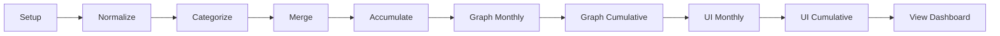

# Agentic Finance Review - 思维模式与 LLM 交互分析

## 一、实现的功能与迭代流程

### 1.1 核心功能

Agentic Finance Review 实现了一个**完全自动化的个人财务审计系统**：

```
原始银行账单 → 自动标准化 → 智能分类 → 多账户合并 → 数据累积 → 可视化图表 → 交互式仪表盘
```

### 1.2 迭代流程详解

项目定义了一个**9阶段顺序流水线**：



| 阶段 | 输入 | 输出 | Agent/Command |
|------|------|------|---------------|
| 0. Setup | CSV文件路径 | `raw_*.csv` | Orchestrator |
| 1. Normalize | `raw_*.csv` | `normalized_*.csv` | normalize-csv-agent |
| 2. Categorize | `normalized_*.csv` | 分类后的CSV | categorize-csv-agent |
| 3. Merge | 多个normalized CSV | `agentic_merged_transactions.csv` | merge-accounts-agent |
| 4. Accumulate | 月度merged | `agentic_cumulative_dataset_{YEAR}.csv` | /accumulate-csvs |
| 5. Graph Monthly | merged CSV | `assets/*.png` (8+图) | graph-agent |
| 6. Graph Cumulative | cumulative CSV | `assets/*.png` (年度图) | graph-agent |
| 7. UI Monthly | CSV + PNG | `index.html` | generative-ui-agent |
| 8. UI Cumulative | cumulative + PNG | `index.html` (年度) | generative-ui-agent |
| 9. View | HTML | 浏览器打开 | Orchestrator |

---

## 二、思维模式与思维链

### 2.1 核心思维模式：专业化自验证 (Specialized Self-Validation)

项目的核心创新是一种**专业化代理 + 自动验证**的思维模式：

```
┌─────────────────────────────────────────────────────────────────┐
│                    Agent 执行层                                  │
│  ┌──────────┐   ┌──────────┐   ┌──────────┐   ┌──────────┐     │
│  │Normalize │ → │Categorize│ → │  Merge   │ → │  Graph   │     │
│  │  Agent   │   │  Agent   │   │  Agent   │   │  Agent   │     │
│  └──────────┘   └──────────┘   └──────────┘   └──────────┘     │
└─────────────────────────────────────────────────────────────────┘
                              ↓ 每步完成后
┌─────────────────────────────────────────────────────────────────┐
│                    验证层 (Hooks)                                │
│  ┌──────────────────────────────────────────────────────────┐  │
│  │  Validator: CSV格式? 余额一致性? 图表数量? HTML结构?     │  │
│  └──────────────────────────────────────────────────────────┘  │
│                              ↓                                 │
│                    ┌─────┬─────┐                              │
│                    │ Pass│Block│                              │
│                    └──┬──┴──┬──┘                              │
│           继续下一步 ←┘     └→ 返回错误 → Agent 自动修正       │
└─────────────────────────────────────────────────────────────────┘
```

### 2.2 思维链维持机制

#### 2.2.1 防御性思维链（Hook 链）

每个 Agent 配置了一个或多个验证器，形成**防御性思维链**：

```yaml
# normalize-csv-agent.md
hooks:
  Stop:
    - hooks:
        - type: command
          command: "uv run .../csv-validator.py"
        - type: command
          command: "uv run .../normalized-balance-validator.py"
```

**验证顺序**：
1. CSV 格式验证 → 检查必需列、日期格式、数值格式
2. 余额一致性验证 → `prev_balance - withdrawal + deposit = current_balance`

如果任何验证失败，Agent 无法"结束"，被迫修正错误。

#### 2.2.2 迭代修正循环

```
Agent 执行操作
    ↓
Hook 触发验证
    ↓
验证结果 ──────────────────┐
    ↓                      │
    ├─ Pass → 允许完成     │
    │                      │
    └─ Block → 返回错误    │
           ↓               │
       Agent 收到错误       │
           ↓               │
       理解错误并修正 ←─────┘
           ↓
       重新执行操作
           ↓
       Hook 再次验证
           ↓
        (循环直到通过)
```

#### 2.2.3 实时反馈验证（PostToolUse）

`csv-edit-agent` 使用更细粒度的验证：

```yaml
hooks:
  PostToolUse:
    - matcher: "Read|Edit|Write"
      hooks:
        - type: command
          command: "uv run .../csv-single-validator.py"
```

**每次文件操作后立即验证**，而非等待任务完成。这确保了：
- 错误被即时发现
- 错误上下文更清晰
- 修正成本更低

### 2.3 思维链特点

| 特点 | 实现方式 |
|------|----------|
| **顺序性** | Agent链按固定顺序执行，前一步输出是后一步输入 |
| **可靠性** | 每步都有验证器把关，错误无法传递到下游 |
| **自修正** | Block机制强制Agent修正错误，形成闭环 |
| **可观测** | 验证器日志记录所有检查过程 |
| **可追溯** | 错误信息明确，包含行号、字段、期望值 |

---

## 三、LLM 交互设计分析

### 3.1 交互模式

项目采用**多层级委托模式**：

```
                    ┌─────────────────┐
                    │     User        │
                    │  /review-finances│
                    └────────┬────────┘
                             ↓
                    ┌─────────────────┐
                    │   Orchestrator  │
                    │ (review-finances)│
                    └────────┬────────┘
                             ↓ 委托
        ┌────────────────────┼────────────────────┐
        ↓                    ↓                    ↓
┌───────────────┐   ┌───────────────┐   ┌───────────────┐
│normalize-agent│   │categorize-agent│   │ graph-agent   │
└───────┬───────┘   └───────┬───────┘   └───────┬───────┘
        ↓                   ↓                    ↓
┌───────────────┐   ┌───────────────┐   ┌───────────────┐
│/normalize-csv │   │/categorize-csv│   │generate_graphs│
│   (command)   │   │   (command)   │   │    (script)   │
└───────────────┘   └───────────────┘   └───────────────┘
```

### 3.2 LLM 交互特点

#### 3.2.1 角色分离

```yaml
# Orchestrator 角色
- 不执行具体操作
- 负责流程编排和错误处理
- 协调多个Agent

# Agent 角色
- 专注于单一任务
- 拥有特定工具集
- 配置专用验证器

# Command 角色
- 可复用的操作模板
- 可被Agent或用户直接调用
- 定义输入输出格式
```

#### 3.2.2 上下文传递

```markdown
# Agent 通过变量继承上下文

## Variables
MONTH: $1
CSV_FILES: $2, $3, $4, ...
ROOT_OPERATIONS_DIR: CLAUDE.md: ROOT_OPERATIONS_DIR  # 从项目配置继承
MONTH_DIR: ROOT_OPERATIONS_DIR/mock_dataset_{MONTH}_1st_{YEAR}
```

#### 3.2.3 错误反馈机制

验证器返回 JSON 格式给 LLM：

```json
// 验证通过
{}

// 验证失败
{
  "decision": "block",
  "reason": "Balance validation failed:\n
    normalized_checkings.csv row 15 (date: 2026-01-15): 
    Balance mismatch! Expected $42,008.46, got $42,008.45"
}
```

**LLM 会收到明确的错误信息**，包括：
- 文件名
- 行号
- 日期
- 期望值 vs 实际值
- 修正建议

### 3.3 交互设计优点

| 优点 | 说明 |
|------|------|
| **明确分工** | 每个Agent只做一件事，Prompt更专注 |
| **验证独立** | 验证逻辑与业务逻辑分离 |
| **错误可操作** | 错误信息足够详细，LLM能理解并修正 |
| **流程可视化** | Orchestrator报告每步进度 |
| **可恢复** | 如果某步失败，可以从该步重试 |

### 3.4 交互设计不足

#### 3.4.1 无状态传递

Agent 之间**没有显式的状态传递机制**：

```
normalize-agent 完成后 → categorize-agent 不知道 normalize 的任何决策
```

如果 normalize 做了特殊处理（如跳过某行），categorize 无法得知。

**潜在问题**：
- 无法处理需要跨阶段上下文的复杂场景
- 错误修正时可能丢失原始上下文

#### 3.4.2 验证器僵化

验证器是**硬编码的Python脚本**：

```python
REQUIRED_COLUMNS = ["date", "description", "category", ...]
MIN_GRAPHS = 5
```

**问题**：
- 修改验证规则需要改代码
- 无法让LLM动态调整验证逻辑
- 不支持"软警告"，只有 Pass/Block

#### 3.4.3 缺乏并行能力

流程是**完全串行**的：

```
Step1 → Step2 → Step3 → ...
```

即使某些步骤可以并行（如多个CSV文件的normalize），也会顺序执行。

**效率损失**：
- 处理多个账户时，可以并行normalize
- 生成多个图表可以并行

#### 3.4.4 上下文窗口压力

Orchestrator需要跟踪所有Agent的输出：

```markdown
## Report
- [x] Setup: Directory created, 2 CSV files placed
- [x] Normalize: 2 files processed
- [x] Categorize: 156 transactions categorized
- ...
```

随着数据量增加，报告内容会消耗大量上下文窗口。

---

## 四、系统潜在问题与不足

### 4.1 架构层面

#### 4.1.1 单点故障

```
如果某个Agent卡住 → 整个流程停止
```

没有：
- 超时机制
- 降级策略
- 跳过选项

#### 4.1.2 无事务回滚

如果流程在中间失败：

```
Step 4 Accumulate 成功 → Step 5 Graph 失败
```

**已生成的文件不会被清理**，下次重跑可能产生不一致。

#### 4.1.3 依赖隐性约定

很多约定没有明确文档化：

```python
# 文件名约定：raw_checkings.csv → normalized_checkings.csv
# 目录结构约定：assets/ 子目录
# 数据格式约定：余额从旧到新排序
```

**风险**：新开发者或Agent可能不了解这些约定。

### 4.2 验证层面

#### 4.2.1 验证覆盖不完整

| 检查项 | 是否验证 |
|--------|----------|
| CSV格式 | ✅ |
| 余额一致性 | ✅ |
| 图表数量 | ✅ |
| HTML结构 | ✅ |
| 分类准确性 | ❌ |
| 金额合理性 | ❌ |
| 日期连续性 | ❌ |
| 账户匹配 | ❌ |

**问题**：分类错误（如把"工资"分成"food"）无法被检测。

#### 4.2.2 验证时机局限

- Stop Hook：任务结束时验证（可能太晚）
- PostToolUse：操作后验证（无法防止错误）

**缺少**：
- PreToolUse：操作前验证（预防性）
- Stream验证：流式输出时验证

### 4.3 LLM 层面

#### 4.3.1 模型依赖

所有Agent使用 `opus` 模型：

```yaml
model: opus
```

**问题**：
- 成本高（即使是简单任务）
- 无模型选择策略
- 没有fallback到更便宜模型

#### 4.3.2 Prompt膨胀

随着项目发展，Prompt会越来越长：

```markdown
# 每个Agent需要知道：
- 自己的任务
- 输入输出格式
- 错误处理方式
- 验证规则
- 与其他Agent的交互方式
```

**风险**：上下文窗口溢出，或关键指令被忽略。

#### 4.3.3 无记忆机制

每次运行都是**全新开始**：

```
运行1: /review-finances jan
运行2: /review-finances feb  # 不知道运行1的任何信息
```

**问题**：
- 无法学习用户偏好（如分类习惯）
- 无法利用历史经验
- 重复错误可能多次出现

### 4.4 可维护性

#### 4.4.1 隐式依赖

Agent之间通过文件系统通信：

```
normalize-agent 写入 normalized_*.csv
categorize-agent 读取 normalized_*.csv
```

**问题**：
- 依赖关系不显式
- 接口变更难以追踪
- 重构风险高

#### 4.4.2 验证器分散

8个验证器脚本分布在 `.claude/hooks/validators/`：

```
csv-validator.py
csv-single-validator.py
graph-validator.py
html-validator.py
normalized-balance-validator.py
ruff-validator.py
ty-validator.py
demo-validator.py
```

**问题**：
- 验证逻辑重复（如CSV解析）
- 日志文件分散
- 难以统一维护

#### 4.4.3 配置碎片化

配置分散在多个地方：

```
CLAUDE.md          → ROOT_OPERATIONS_DIR
settings.json      → 权限配置
每个Agent的frontmatter → model, tools, hooks
```

**问题**：修改配置需要多处同步。

---

## 五、改进建议

### 5.1 短期改进

1. **添加分类验证器**
   ```python
   # category-validator.py
   # 检查分类是否在预定义列表中
   # 检查是否有"obvious"分类错误（如PAYCHECK在food类）
   ```

2. **增加超时机制**
   ```yaml
   hooks:
     Stop:
       - timeout: 300  # 5分钟超时
   ```

3. **模型选择策略**
   ```yaml
   # 简单任务用更便宜的模型
   - name: normalize-csv-agent
     model: haiku  # 规则明确的任务
   
   - name: categorize-csv-agent
     model: opus   # 需要理解语义的任务
   ```

### 5.2 中期改进

1. **引入状态管理**
   ```json
   // state.json
   {
     "last_run": "2026-01-15",
     "categories_learned": {
       "AMAZON": "amazon",
       "TRADER JOE": "food"
     }
   }
   ```

2. **支持并行执行**
   ```yaml
   # review-finances.md
   ## Parallel Execution
   - normalize all raw_*.csv files in parallel
   - wait for all to complete
   - then proceed to categorize
   ```

3. **软验证警告**
   ```json
   {
     "decision": "warn",  // 不阻塞，但警告
     "reason": "High spending in 'other' category: $500"
   }
   ```

### 5.3 长期改进

1. **事件驱动架构**
   ```
   normalize完成 → 发布事件 → categorize自动触发
   ```

2. **自适应验证**
   ```python
   # LLM动态生成验证规则
   validator = generate_validator(sample_data, business_rules)
   ```

3. **学习机制**
   ```
   用户手动修正分类 → 记录偏好 → 下次自动应用
   ```

---

## 六、总结

### 6.1 核心创新

Agentic Finance Review 的核心创新是**专业化自验证模式**：

```
Focused Agent + Specialized Validation = Trusted Automation
```

这种模式解决了LLM Agent的**可靠性问题**：
- Agent专注单一任务，减少幻觉
- 验证器提供确定性保证
- Block机制强制错误修正

### 6.2 主要局限

| 层面 | 局限 | 影响 |
|------|------|------|
| 架构 | 串行执行 | 效率低 |
| 验证 | 覆盖不完整 | 某类错误无法检测 |
| LLM | 无记忆 | 无法学习改进 |
| 维护 | 隐式依赖 | 重构困难 |

### 6.3 适用场景

**适合**：
- 流程化、规则明确的任务
- 需要高可靠性的自动化
- 可分解为独立步骤的工作

**不适合**：
- 需要大量创造性判断的任务
- 高度动态变化的场景
- 需要跨步骤上下文的复杂推理

### 6.4 借鉴价值

这个项目展示了如何**将软件工程的可靠性实践引入LLM Agent开发**：

| 软件工程实践 | Agent 对应实现 |
|--------------|----------------|
| 单元测试 | Stop Hook 验证器 |
| 类型检查 | CSV 格式验证 |
| CI/CD | Agent 流水线 |
| 代码审查 | PostToolUse 验证 |
| 错误处理 | Block + 自动修正 |

这种**将传统工程方法与LLM能力结合**的思路，是构建可信AI系统的关键。
